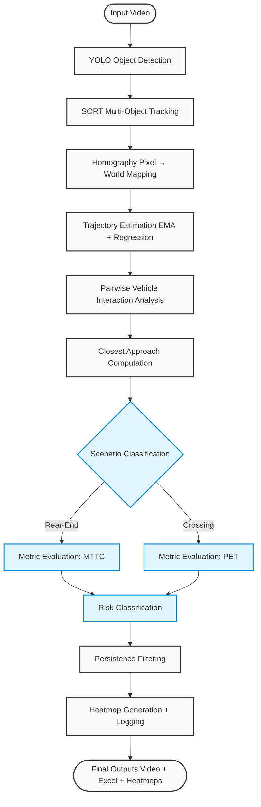
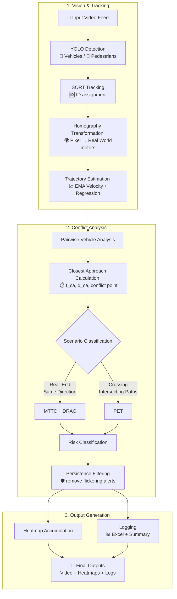

<div align="center">

# 🚦 Automatic Video-Based Road Safety Analysis for Urban Streets
### Surrogate Safety-Based Risk Detection using MTTC & PET

[](https://python.org)
[](https://opencv.org/)
[](#)
[](https://numpy.org/)

**A Proactive, Computer Vision-Based Traffic Safety Analysis System.**

[Overview](#overview) •
[Architecture](#architecture) •
[Metrics](#metrics) •
[Outputs](#outputs) •
[Tech Stack](#tech-stack)

</div>

---

<a id="overview"></a>
## 📌 Overview

This project presents a **computer vision-based traffic safety analysis system** that detects and quantifies *near-miss events* (traffic conflicts) from video footage.

Instead of relying on historical crash data—which is rare, delayed, and reactive—this system uses **Surrogate Safety Measures (SSMs)** to identify risky interactions in real time directly from normal traffic video.

### 🎯 Core Objective

To detect, classify, and spatially analyze **traffic conflicts** using research-backed metrics:
- 🔴 **MTTC (Modified Time to Collision)** → For Rear-end conflicts
- 🔵 **PET (Post Encroachment Time)** → For Crossing conflicts

---

## 🧠 Why This Matters

| Traditional Accident Analysis ❌ | This System ✅ |
| :--- | :--- |
| **Reactive:** Relies on crashes that have already happened. | **Proactive:** Identifies dangerous behavior *before* crashes occur. |
| **Sparse Data:** Crashes are statistically rare events. | **High-Frequency:** Generates rich safety insights from daily traffic. |
| **Manual:** Requires police reports and manual surveys. | **Automated:** Works on standard traffic video feeds. |

👉 **Ultimate Goal:** Enable early intervention in dangerous zones by identifying high-risk hotspots.

---

<a id="architecture"></a>
## 🏗️ System Architecture



---

## 🔄 Detailed Workflow



---

## ⚙️ Core Components

### 🔍 1. Object Detection
* **Model:** YOLO (Ultralytics)
* **Detects:** Cars, Two-wheelers, Pedestrians

### 🧾 2. Multi-Object Tracking
* **Algorithm:** SORT (Simple Online and Realtime Tracking)
* **Function:** Assigns and maintains persistent IDs across video frames.

### 🌍 3. World Coordinate Mapping
* **Method:** Homography matrix transformation.
* **Function:** Transforms pixel coordinates into real-world meters, enabling **physics-based analysis**.

### 📈 4. Motion Estimation
* **Velocity:** Exponential Moving Average (EMA) for smooth speed estimation.
* **Direction:** Linear regression for stable trajectory prediction.
* **Acceleration:** Derived mathematically from velocity changes over time.

---

## ⚠️ Conflict Detection Logic

**Step 1: Distance Filtering**  
Ignore vehicles that are far away from each other to save compute.

**Step 2: Closest Approach**  
Compute Time to closest approach (TCA), minimum distance, and the exact spatial conflict point.

**Step 3: Scenario Classification**  

| Scenario | Condition | Safety Metric Used |
| :--- | :--- | :--- |
| **Rear-End** | Same direction of travel | TTC, DRAC, MTTC |
| **Crossing** | Intersecting paths | PET |

---

<a id="metrics"></a>
## 📊 Safety Metrics & Risk Classification

### 🔴 Rear-End Conflicts
* **TTC** → Time to Collision
* **DRAC** → Deceleration Rate to Avoid Crash
* **MTTC** → Modified Time to Collision (Accounts for relative acceleration)

| Risk Level | Condition |
| :--- | :--- |
| 🚨 **CRITICAL** | `TTC < 1.5s` **AND** `DRAC ≥ 3.4` **AND** `MTTC < 1.5s` |
| ⚠️ **WARNING** | Moderate risk parameters |
| ✅ **MONITOR** | Safe interactions |

### 🔵 Crossing Conflicts
* **PET (Post Encroachment Time)** = `|t1 - t2|` *(Where t1, t2 are arrival times at the conflict point)*

| Risk Level | Condition |
| :--- | :--- |
| 🚨 **CRITICAL** | `PET < 1.0s` |
| ⚠️ **WARNING** | `PET < 2.0s` |
| ✅ **MONITOR** | `PET ≥ 2.0s` |

---

## 🔥 Heatmap Generation

Visualizing spatial risk is crucial for urban planning.

* **🔴 MTTC Heatmap:** Only accumulates critical rear-end conflicts (`MTTC < 1.5s`).
* **🔵 PET Heatmap:** Only accumulates unsafe crossing interactions (`PET < 2.0s`). Based on thresholds defined by Allen et al. (1978) and FHWA.

---

<a id="outputs"></a>
## 📁 Outputs Structure

After execution, the system generates the following assets:

```text
/working_directory/
│
├── final.mp4                 # 🎥 Annotated video with bounding boxes & risk levels
├── collision_log.xlsx        # 📊 Detailed event log (IDs, TTC, PET, Risk)
├── heatmap_mttc_rearend.png  # 🔴 Spatial heatmap of rear-end conflicts
├── heatmap_pet_crossing.png  # 🔵 Spatial heatmap of crossing conflicts
└── heatmap_combined.png      # 🟣 Combined risk visualization
```

---

## 🧪 Key Strengths

- 🛡️ **Physics-Based Modeling:** Relies on real-world kinematics, not just opaque ML black-boxes.
- 🚦 **Scenario-Aware:** Dynamically applies the right metric (MTTC vs PET) based on the interaction type.
- 📉 **Noise Reduction:** Implements persistence filtering to prevent alert flickering.
- 🗺️ **Spatial Visualization:** Transforms abstract numbers into actionable geographic heatmaps.
- 📚 **Research-Backed:** Utilizes established safety thresholds from FHWA and AASHTO.

---

<a id="tech-stack"></a>
## 🛠️ Tech Stack

<div align="left">
  
  
  
  
  
</div>

* **Tracker:** SORT (Simple Online and Realtime Tracking)
* **Data Processing:** OpenPyXL (for Excel logging)

---

## 🚀 Future Work

- [ ] **Real-time deployment:** Direct CCTV stream integration.
- [ ] **Lane-wise conflict detection:** Granular analysis by lane topology.
- [ ] **AI Trajectory Prediction:** Implement LSTM / Transformer networks for better path forecasting.
- [ ] **Risk Normalization:** Adjust risk scores based on real-time traffic density.
- [ ] **Dashboard Visualization:** Interactive web-based analytics dashboard.

---

## 📚 References

1. **Allen, B. L., Shin, B. T., & Cooper, P. J. (1978)** - *Analysis of Traffic Conflicts and Collisions*
2. **Gettman, D., & Head, L. (2003)** - *Surrogate Safety Measures from Traffic Simulation Models*
3. **AASHTO** - *Design Guidelines for DRAC*

---

## 👨‍💻 Author

**Shashwat Kumar Jha**  
IIT (BHU), Varanasi  

---

## ⭐ Support

If you found this project useful or interesting:
- **Star** ⭐ the repository
- **Fork** 🍴 it to experiment
- **Build** 🚀 on top of it!
