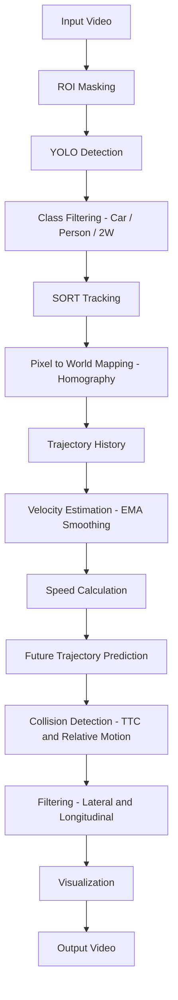

# 🚀 Predictive Traffic Collision Detection System

A computer vision + physics-based system for **multi-class traffic monitoring and collision prediction** using real-world video data.

---

## 📌 Overview

This project detects, tracks, and analyzes traffic participants in a video feed and predicts **potential collisions before they occur** using **time-to-collision (TTC)** and trajectory modeling.

Unlike traditional systems that rely only on proximity, this system is **predictive**, leveraging velocity and motion patterns to estimate future interactions.

---

## 🔄 Pipeline Flowchart



---

## 🎯 Key Features

* 🚗 **Multi-class Detection & Tracking**

  * Car (0)
  * Person (1)
  * 2-Wheeler (2)

* 📍 **Homography-based World Mapping**

  * Converts pixel coordinates → real-world coordinates (meters)

* 🧠 **Velocity Estimation with EMA Smoothing**

  * Reduces noise and stabilizes motion

* 🔮 **Future Trajectory Prediction**

  * Predicts motion paths for up to 5 seconds

* ⚠️ **Collision Prediction (TTC-based)**

  * Uses relative velocity and position

* 🚦 **Advanced Collision Filtering**

  * Lateral and longitudinal constraints
  * Eliminates false positives (parallel motion)

* 📊 **Live Analytics**

  * Vehicle count
  * Speed estimation (km/h)

---

## 🧠 Core Idea

Each object is modeled using:

* Position: ( p )
* Velocity: ( v )

Time-to-collision is computed as:

```math
t = - \frac{(p_2 - p_1) \cdot (v_2 - v_1)}{(v_2 - v_1) \cdot (v_2 - v_1)}
```

This estimates **when two objects will be closest in the future**, enabling proactive collision detection.

---

## 🏗️ Tech Stack

* **Python**
* **OpenCV**
* **NumPy**
* **Ultralytics YOLO (custom trained model)**
* **SORT Tracker**
* **Homography (projective geometry)**

---

## 📂 Project Structure

```
.
├── main.py
├── sort/
│   └── sort.py
├── model/
│   └── best.pt
├── input/
│   └── video.mp4
├── output/
│   └── final_output.mp4
```

---

## ▶️ How to Run

### 1. Install dependencies

```bash
pip install ultralytics opencv-python numpy
```

### 2. Update paths in code

* YOLO model path
* Input video path

### 3. Run the script

```bash
python main.py
```

### 4. Output

The processed video will be saved at:

```
/kaggle/working/final_output.mp4
```

---

## 📸 Output Highlights

* Bounding boxes with:

  * Class labels
  * Speed (km/h)
  * Track ID

* Trajectories:

  * Past (smoothed)
  * Future (predicted)

* Collision visualization:

  * Predicted interaction point
  * Highlighted paths

---

## ⚙️ Important Parameters

| Parameter              | Description                     |
| ---------------------- | ------------------------------- |
| `ALPHA`                | Velocity smoothing factor (EMA) |
| `dt`                   | Time between frames             |
| `TTC window`           | Prediction horizon (~5 sec)     |
| Lateral threshold      | X-axis filter                   |
| Longitudinal threshold | Y-axis filter                   |

---

## 🚀 Future Improvements

* 🔥 Collision severity classification (vehicle vs pedestrian)
* 📊 Traffic density heatmaps
* 🧠 DeepSORT / ReID tracking
* 🌐 Multi-camera integration
* 📈 Real-time dashboard

---

## 🏆 Applications

* Smart traffic monitoring systems
* Autonomous driving safety
* Accident prevention
* Urban traffic analytics

---

## 💡 Key Insight

> This system predicts **where objects WILL be**, not just where they ARE.

---

## 🙌 Acknowledgements

* Ultralytics YOLO
* SORT Tracking Algorithm
* OpenCV Community

---

## 👨‍💻 Author

**Shashwat**
IIT BHU

---

## ⭐ If you like this project

Give it a ⭐ on GitHub — it helps a lot!
